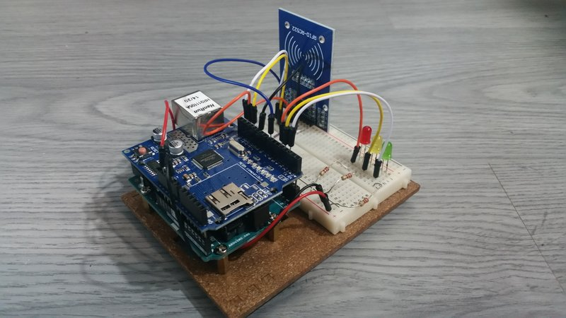

# ContolFid

######Control de acceso/asistencia 

## Descripción

Proyecto de fin de curso 2014-2016 del ciclo formativo de desarrollo de aplicaciones web

En éste proyecto, hemos creado una empresa temporal, la cual se dedica mediante tecnologías de hoy en día al control de asistencia/acceso en cualquier entorno mediante un dispositivo electrónico y una aplicación web.

En el siguente apartado se detallan los pasos a seguir para la implementación de nuestra aplicación.

* * *

[Web ControlFid](controlfid.zubirimanteoweb.com)  

* * *

## Documentación

Primeramente descargar el código desde éste repositorio, acceder a él desde la línea de comandos y ejecutar 'npm install' para instalar los módulos necésarios para el funcionamiento. [Guía de instalación de NodeJS y npm](https://github.com/ionatibia/nodejs)  
Para poner en marcha la aplicación ejecutar "node ./bin/www.js".

### Dispositivo

El dispositivo utilizado en éste proyecto ha sido diseñado por alumnos de Don Bosco, pero en éste documento se detalla como hacerlo con un dispositivo Arduino o sin ningún dispositivo.

*	Sin dispositivo: Podemos utilizar cualquier REST client como [PostMan para Chrome](https://chrome.google.com/webstore/detail/postman/fhbjgbiflinjbdggehcddcbncdddomop) o [REST Client para Android](https://play.google.com/store/apps/details?id=com.sourcestream.android.restclient&hl=es). La dirección GET en ambos casos, para el cambio de presencia es 'http://'donde este alojada la aplicación'/presencia?num_tarjeta='número de tarjeta'&room='numero dispositivo''.
Es posible añadir '&time='00:00:00'' si no se añade, utilizará la hora del sistema.

*  Arduino

	*	Materiales: 
		*	[Placa arduino UNO](https://www.google.es/search?sourceid=chrome-psyapi2&ion=1&espv=2&ie=UTF-8&q=arduino%20UNO&oq=arduino%20UNO&aqs=chrome..69i57j0l5.2722j0j7)
		*	[Ethernet shield](https://www.google.es/search?sourceid=chrome-psyapi2&ion=1&espv=2&ie=UTF-8&q=ethernet%20shield%20arduino&oq=ethernet%20shield%20&aqs=chrome.1.69i57j0l5.4435j0j9)
		*	[RFID rc522](https://www.google.es/search?espv=2&q=arduino+rfid+rc522&oq=arduino+rfi&gs_l=serp.1.1.0l10.26130.28270.0.30137.11.11.0.0.0.0.116.913.7j3.10.0....0...1c.1.64.serp..1.10.910.z9XDkjYuEvo)

	*	Conexiones:
		*	RFID:
			*	SDA -> pin7
			*	SCK -> pin13
			*	MOSI -> pin11
			*	MISO -> pin12
			*	GND -> GND
			*	RST -> pin9
			*	3.3V -> 3.3V
		*	LEDs:
			*	Verde -> pin2
			*	Amarillo -> pin3
			*	Rojo -> pin4
			*	Resistencias de 220 Ohm

	*	Código:
		*	Descargar el código desde el [repositorio](https://github.com/ionatibia/Arduino_Proyects/tree/master/proyecto27_Controlfid_V1).
		*	Sustituir el nombre del servidor de la línea 29 por el vuestro o la IP
		*	Comprobar con el monitor serie de Arduino el número de las tarjetas y añadirlas a la base de datos de la aplicación

	

### Base de datos

*   **MySQL:** Importar base de datos mediante phpMyAdmin o línea de comandos a MySQL local o en la nube. Hay 2 opciones:
    1.  Cotrolfid.sql: Contiene datos de alumnos, clases, profesores, etc... preinsertados para una utilización rápida de la aplicación. **Las contraseñas** de los profesores son como usuario profesor(1-5)@zubirimanteo.com y como contraseña para todos su correspondiente profesor(1-5).
    2.  ControlfidVacio.sql: Contiene 1 único usuario con permisos de administrador para tener el esquema vacio e ir configurándolo a gusto del consumidor (seguir pasos del apartado Uso). Ususario: admin pasword: admin.

*   **Conexión en local:** Modificar los parámetros que están entre comillas simples en el archivo 'models/connection.js' host,puerto,usuario,contraseña, el nombre de la base de datos no es necesario modificar.
*   **Openshift:** No hay que modificar nada.
*   **Cloud 9:** Comentar el código existente y descomentar el segundo código en el archivo 'models/connection.js'.

*   **Mongo:** Crear una cuenta en MongoLabs o utilizar servidor Mongo local. Crear una Collection llamada 'faltas' y modificar la dirección del servidor mongo (@ds059215.mongolab.com:59215/faltas) en el archivo 'models/mongo.js'. Para el usuario y la contraseña guardarlos en variables de entorno con los nombres, MONGO_USER y MONGO_PASSWORD. [Guía Openshift](https://developers.openshift.com/en/managing-environment-variables.html). En local utilizar en la llamada a la aplicación "MONGO_USER='el usuario' MONGO_PASSWORD='el password' node ./bin/www.js"

### Correo

*   **Maigun:** Crear cuenta en Mailgun, guardar el dominio y la ApiKey como variables de entorno con los nombres MAILGUN_DOMAIN y MAILGUN_API_KEY. Para la configuración del correo con el dominio [acceder aquí](https://github.com/ionatibia/php/tree/master/tests/3-mailgun)

###Uso

###API
